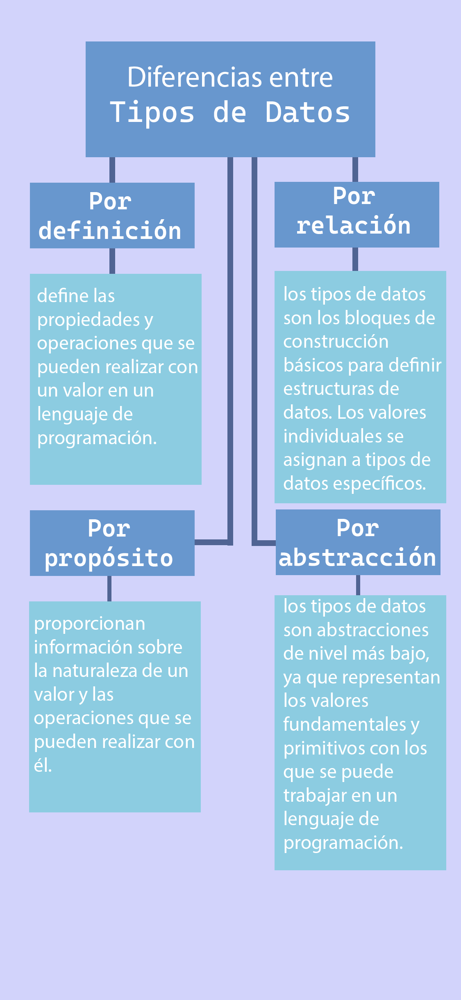

### Por propósito
Los tipos de datos ***proporcionan información sobre la naturaleza de un valor y las operaciones que se pueden realizar con él.*** Permiten al lenguaje de programación realizar verificaciones de tipo y garantizar la compatibilidad y coherencia de los datos utilizados en un programa.
### Por nivel de abstracción
Los tipos de datos son abstracciones de nivel más bajo, ya que ***representan los valores fundamentales y primitivos con los que se puede trabajar en un lenguaje de programación.***
### Por Relación
Los tipos de datos ***son los bloques de construcción básicos para definir estructuras de datos.*** Los valores individuales se asignan a tipos de datos específicos.

---

---