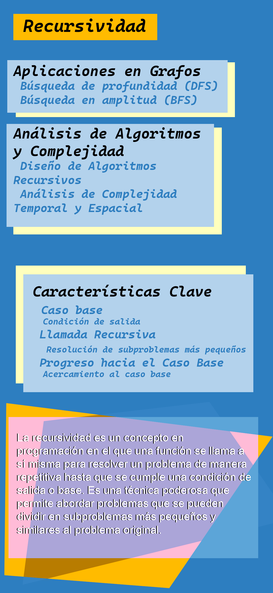

# Recursividad
## Concepto
La recursividad es un concepto en programación en el que **una función se llama a sí misma para resolver un problema de manera repetitiva** hasta que se cumple una condición de salida o base. Es una técnica poderosa que permite abordar problemas que se pueden dividir en subproblemas más pequeños y similares al problema original. La aplicación de la recursividad puede ser útil en diversas situaciones, como:
Problemas que se pueden dividir en subproblemas más pequeños: **La recursividad es especialmente útil cuando un problema se puede descomponer en instancias más pequeñas y similares del mismo problema.** Cada instancia más pequeña se resuelve llamando recursivamente a la misma función.

---
