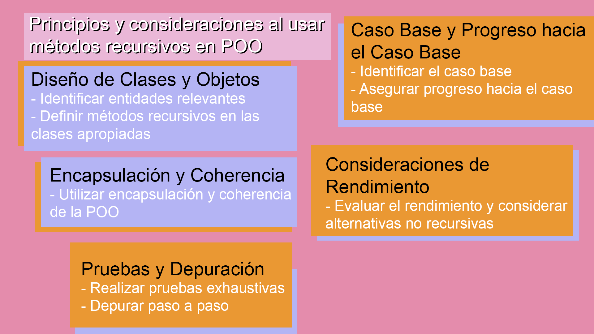

# Ejercicio de Recursividad en Programación Orientada a Objetos (POO)

## Conceptos Básicos

### Recursividad en POO

El manejo de métodos recursivos en el contexto de la orientación a objetos implica utilizar la recursividad dentro de las clases y objetos para resolver problemas de manera recursiva.

Principios y consideraciones al usar métodos recursivos en POO:

1. **Diseño de Clases y Objetos**
   - Identificar entidades relevantes
   - Definir métodos recursivos en las clases apropiadas

2. **Caso Base y Progreso hacia el Caso Base**
   - Identificar el caso base
   - Asegurar progreso hacia el caso base

3. **Encapsulación y Coherencia**
   - Utilizar encapsulación y coherencia de la POO

4. **Consideraciones de Rendimiento**
   - Evaluar el rendimiento y considerar alternativas no recursivas

5. **Pruebas y Depuración**
   - Realizar pruebas exhaustivas
   - Depurar paso a paso
  
---

---

## Ejemplo de Código de Recursividad en POO

```python
class RecursividadPOO:
    def recursive_method(self, n):
        # Caso base
        if n == 0:
            return 1
        # Llamada recursiva con progreso hacia el caso base
        return n * self.recursive_method(n - 1)

# Uso del método recursivo en un objeto
obj = RecursividadPOO()
result = obj.recursive_method(5)
print("Resultado:", result)  # Salida: Resultado: 120
```
## Explicación del código
1. **Caso Base:**
   - Si n es igual a 0, se alcanza el caso base y se devuelve 1. Este es el punto en el que la recursión se detiene.
2. **Llamada Recursiva:**
   - Si n no es 0, se realiza una llamada recursiva. La función se llama a sí misma con un argumento n - 1. Esto significa que el problema se divide en problemas más pequeños y se acerca al caso base en cada llamada recursiva.
3. **Retorno del Resultado Recursivo:**
   - El resultado de la llamada recursiva se multiplica por n y se devuelve. Esto es fundamental para calcular el factorial. Por ejemplo, para calcular el factorial de 5 (n=5), se multiplica 5 por el factorial de 4, luego por el factorial de 3, y así sucesivamente hasta llegar al caso base.